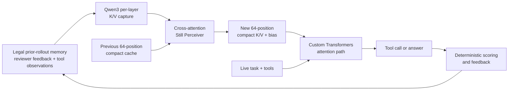
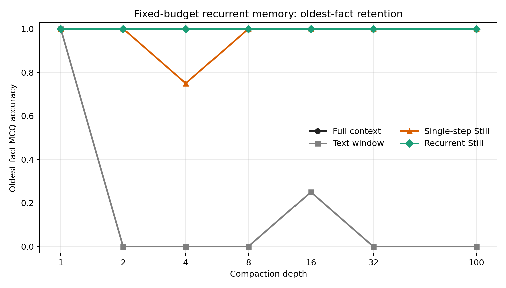
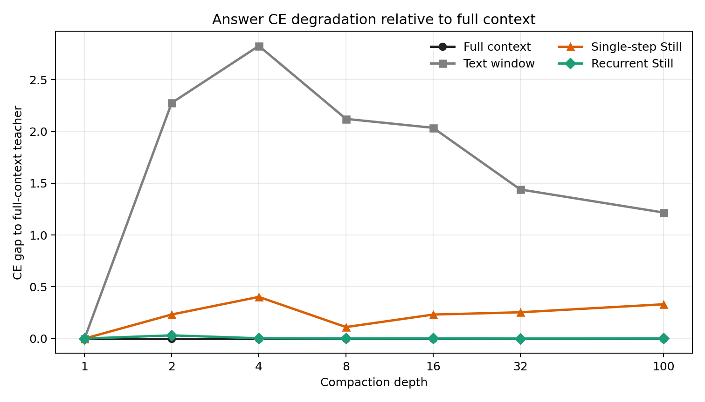
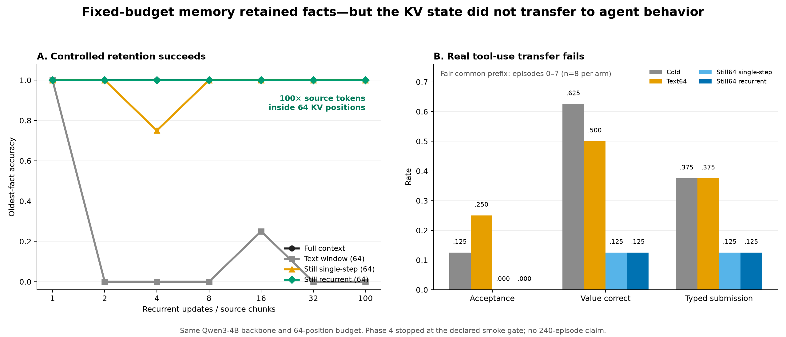

# Cartridges: Recurrent KV Cache Compaction for Continual LLM Memory

> Can a language model carry an ever-growing stream of experience inside a fixed neural-memory
> budget—without RAG, an expanding prompt, or changing the base model's weights?

Cartridges is a research prototype built by a three-person team at the **Touch Weights — Construct
Labs × Alexandria Hackathon**. We trained a cross-attention Perceiver to recurrently compress
Qwen3's per-layer key/value cache into **64 fixed KV positions**, then connected that state to a
real tool-using continual-learning agent.

This is not another retrieval wrapper. It modifies the model's inference path: prior rollout
memory becomes learned K/V tensors, injected through a custom Hugging Face attention
implementation while the current task and tool conversation remain live.

**Keywords:** LLM systems · KV cache · neural memory · continual learning · context compression ·
knowledge distillation · Perceiver · custom attention · tool calling · agent evaluation · Qwen3 ·
PyTorch · Hugging Face Transformers · CUDA · H100 · SkyPilot · Kubernetes · MLOps

## Results at a glance

| Result | Measured outcome |
|---|---|
| Fixed neural-memory budget | **64 KV positions at every layer and recurrence depth** |
| Effective controlled compression | **6,400 source tokens represented by 64 positions — 100×** |
| Held-out controlled retention | **56/56 correct** across depths 1, 2, 4, 8, 16, 32, and 100 |
| Depth-100 fidelity | Forward KL **0.02093**, versus **0.33279** for single-step training |
| Local Qwen agent | Real CRM/wiki/answer tools, verifier scoring, feedback, and full trace capture |
| Validation | **137 Hackathon tests + 30 Still tests**, Ruff and immutable-result checks |
| Real-agent transfer | Failed the declared smoke gate; diagnosed and stopped before an invalid 240-run claim |

The controlled result is strong: recurrence-aware training preserves early facts after 100 cache
updates while a same-budget text window forgets them. The real-agent result is equally important:
the learned cache did not preserve Qwen's tool-call protocol, exposing a concrete gap between
**remembering a fact** and **conditioning reliable agent behavior**.

## System architecture



For the first memory chunk, the Perceiver compresses raw Qwen K/V. Every later update combines
the previous synthetic cache with new raw K/V and compresses the pair back to 64 positions:

```python
state = compact_tokens(first_chunk)
for new_chunk in memory_stream:
    state = recompact(state, new_chunk)  # still exactly 64 positions
```

The difficult part is distribution shift: after the first update, the compactor consumes its own
generated K/V rather than only raw base-model K/V. We addressed that by training on on-policy
recurrent states sampled at mixed depths `{1, 2, 4, 8}`.

## What we built

- **A Hugging Face-native Still implementation.** A frozen Qwen3 base model, trainable per-layer
  Perceiver, compact K/V plus attention bias, and a registered custom attention implementation.
- **Differentiable recurrent compaction.** `recompact_train` captures new raw K/V under
  `no_grad`, detaches prior state for bounded-memory training, and backpropagates only through the
  Perceiver's final recurrent update.
- **A deterministic recurrent-memory dataset.** Synthetic access-code facts with randomized MCQ
  answers, controlled fact age, held-out seeds, and recurrence depths up to 100.
- **A four-arm evaluator.** Full context, a 64-token text window, recursively applied single-step
  Still, and recurrence-aware Still under an equal 64-position budget.
- **A local Qwen tool agent.** Native Qwen tool-call parsing, in-process CRM/wiki/answer dispatch,
  multi-turn execution, deterministic verifier scoring, reviewer feedback, and complete traces.
- **A leakage-safe memory boundary.** The persistent state accepts only verbatim reviewer
  corrections and the agent's own tool observations—never accepted labels, reward fields, hidden
  episode metadata, or submitted answers.
- **Production-minded experiment plumbing.** Atomic per-episode checkpoint/resume, immutable
  versioned results, hash-audited memory events, paired bootstrap reports, failure replay, and
  H100 jobs on a persistent SkyPilot cluster.

## Controlled retention: the compactor works

We froze `Qwen/Qwen3-4B` and trained only the Perceiver in bfloat16. Stage one used 50
single-step updates; stage two used 75 recurrence-aware updates. The final evaluation used eight
held-out examples at each of seven depths, with a fixed 64-token incoming chunk and 64 memory
positions.

| Method | Budget | Depth 1 | Depth 8 | Depth 32 | Depth 100 |
|---|---:|---:|---:|---:|---:|
| Full context | grows | 1.000 | 1.000 | 1.000 | 1.000 |
| Text window | 64 text positions | 1.000 | 0.375 | 0.250 | 0.375 |
| Single-step Still | 64 KV positions | 1.000 | 1.000 | 0.875 | 1.000 |
| **Recurrent Still** | **64 KV positions** | **1.000** | **1.000** | **1.000** | **1.000** |

For oldest-fact questions, the 64-token text window fell to zero accuracy after the first chunk.
Recurrent Still remained perfect through depth 100.



Accuracy alone hides probability drift. At depth 100, single-step Still still selected the correct
letter but diverged substantially from the full-context teacher. Recurrence-aware training cut
forward KL by **93.7%** and reduced the answer cross-entropy gap from `0.33062` to `0.00014`.

<details>
<summary>Show the probability-fidelity plot</summary>



</details>

Raw metrics, all 224 method/example records, tables, and plots are versioned under
[`reports/phase3/phase_3_qwen3_4b_fixed64_v1/`](reports/phase3/phase_3_qwen3_4b_fixed64_v1/).

## Real tool-use transfer: the smoke gate caught a failure

We then integrated the cache with the Alien API continual-learning track: one fictional CRM/ERP,
240 ordered episodes, undocumented API behavior, reviewer corrections, and deterministic scoring.
The declared protocol required four same-model arms—Cold, Text64, Still64 single-step, and Still64
recurrent—to pass a 30-episode promotion smoke before launching the full run.

The neural arms failed that gate:

- Single-step Still completed 30 episodes but produced only **1 typed submission**, indicating
  tool/answer-protocol collapse.
- Recurrent Still reproducibly emitted an unclosed `submit_answer` call at episode 8, followed by
  repeated schema-like closing tags until the generation limit.
- Chat-template parity, custom-attention invocation, finite tensors, and the 64-position invariant
  all passed. Replaying the exact episode-8 checkpoint reproduced the failure.



We stopped instead of presenting an incomparable or cherry-picked 240-episode result. On the fair
common prefix of eight episodes, the recurrence-aware arm scored `0.000` acceptance versus `0.125`
Cold and `0.250` Text64. The result does **not** support a real-agent improvement claim.

That negative result sharpened the research question: a compactor trained to preserve answers can
still distort the token-level control signals needed for structured generation. The next model
should use task-shaped distillation and protocol-aware objectives—not merely more synthetic
recurrence depth.

See the [Phase 4 common-prefix report](reports/phase4/qwen3_4b_seed17_v1/report_paired_008/report.md)
and the [full implementation and experiment log](implementation_plan.md).

## Engineering and research stack

| Area | Tools and techniques |
|---|---|
| Models | `Qwen/Qwen3-4B`, Qwen3-8B, frozen autoregressive transformers |
| ML | PyTorch, bfloat16, AdamW, forward-KL distillation, teacher/student training, Perceiver cross-attention |
| Inference | Hugging Face Transformers, custom attention registration, KV-cache capture/injection, manual autoregressive decode |
| Agents | Structured tool calling, multi-turn tool execution, CRM/ERP and wiki tools, `verifiers` traces and deterministic rewards |
| Evaluation | Controlled synthetic data, same-budget ablations, paired arms, bootstrap confidence intervals, failure replay |
| Infrastructure | NVIDIA H100 80 GB, CUDA, SkyPilot, Kubernetes-backed jobs, persistent artifact storage |
| Developer tooling | Python 3.12, `uv`, pytest, Ruff, Git, YAML, Matplotlib |

The Qwen3-4B training run peaked at **9.98 GB allocated GPU memory**. Each trained Perceiver
checkpoint is approximately **492 MB**, while the base model remains frozen.

## Repository map

```text
hackathon/
├── src/cartridge_memory/       Qwen agent, legal memory, text/KV ledgers, resume state
├── examples/                   rollout, Phase 4 evaluation/reporting, interactive Qwen terminal
├── training/                   reproducible SkyPilot jobs for Phases 1–4
├── reports/                    immutable metrics, plots, and transfer-failure analysis
├── tests/                      agent, cache, leakage, resume, and reporting tests
├── HACKATHON_README.md         organizer's original Alien API brief
└── implementation_plan.md      decisions, measured results, gates, and limitations

still/
├── src/still/model/            Perceiver, CompactCache, custom attention, model wrapper
├── src/still/data/             QuALITY preprocessing and recurrent synthetic data
├── src/still/train_recurrent.py
└── src/still/eval_recurrent.py
```

## Run the local test suites

From the repository root:

```bash
cd hackathon
uv sync --extra dev --extra examples
uv run pytest -q

cd ../still
uv sync
uv run pytest -q
```

The 4B training and evaluation jobs require an NVIDIA GPU. Reproducible cluster task files are in
[`training/`](training/); the minimal standalone Still workflow is documented in
[`../still/README.md`](../still/README.md).

## What we would build next

1. Distill on legal, task-shaped memory streams: reviewer rules, API failure modes, and structured
   tool traces rather than access-code MCQs alone.
2. Add protocol-aware losses for tool names, JSON structure, end tags, and answer submission.
3. Implement the remaining Still architecture fixes: RoPE strip/re-application,
   final-RMSNorm handling, and identity-oriented initialization.
4. Re-run the declared smoke gate, then promote unchanged code to the full 240-episode stream.
5. Explore swappable task-specific **Cartridges** only after one global compact cache transfers
   reliably; retrieval and hyperbolic routing remain separate research questions.

## Context and attribution

- [Original Alien API hackathon brief](HACKATHON_README.md)
- [STILL: Neural KV Cache Compaction](https://arxiv.org/abs/2606.07878)
- [Our Hugging Face-native Still implementation](../still/README.md)

Built as a hackathon research prototype. Results are reported with their actual evaluation size,
controls, failure gates, and known limitations.
