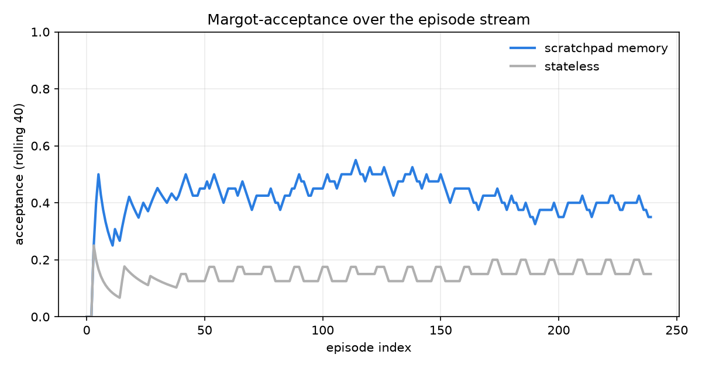
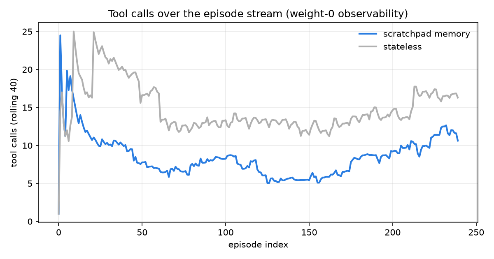
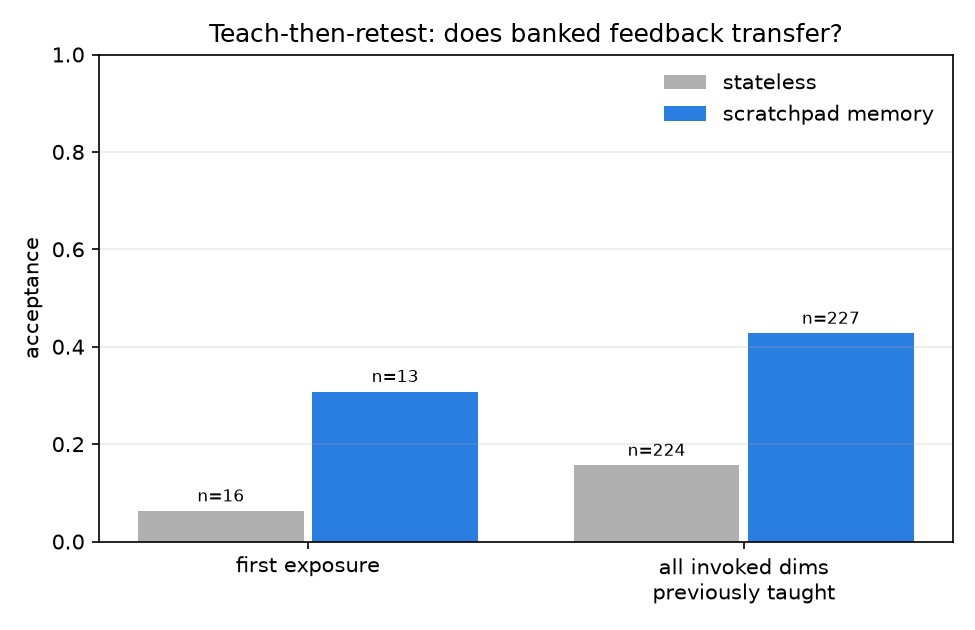
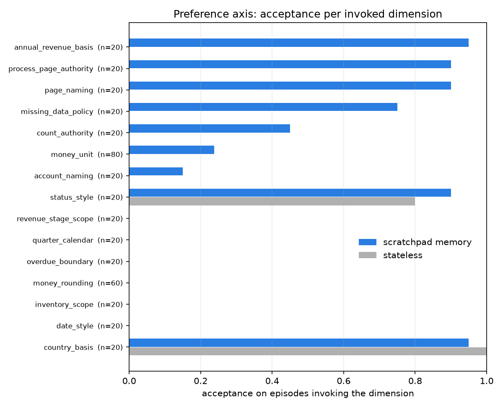
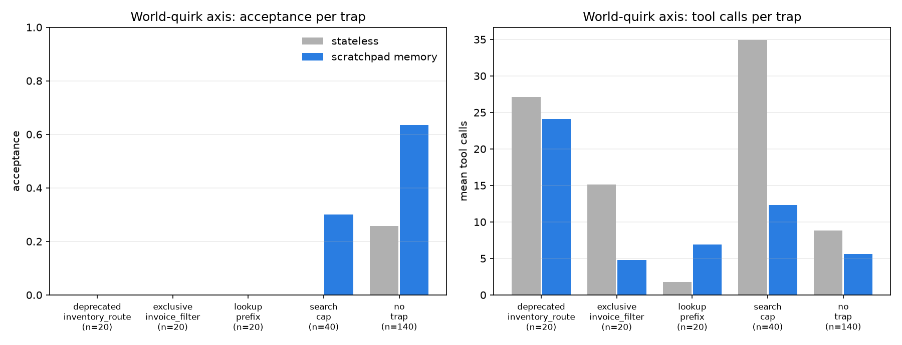

# Outer-loop scratchpad memory on alien-api

The paired-arm trial behind the environment's headline claim. One agent
(gpt-5.6-luna, medium effort, Responses API) ran all 240 fleet episodes twice in
the same order. The **stateless** arm starts every episode cold. The **memory**
arm carries a scratchpad between episodes with two sections, a mechanical
corrections ledger (Margot's feedback sentences, appended and deduped, never
paraphrased) and short LLM-written operational notes distilled from tool
digests. Nothing else differs. Driver:
`examples/scratchpad_loop.py`.

Acceptance below is the current binary reward, 1.0 iff the submitted answer
equals the Margot-accepted label. The archived trial predates the removal of
the efficiency multiplier, so its stored `reward` field is not comparable; the
`preference_accepted` field is identical to today's reward and is what this
report uses throughout.

## Headline

| metric | stateless | scratchpad memory |
|---|---|---|
| acceptance (240 episodes) | 0.150 | **0.421** |
| mean tool calls | 14.6 | **8.3** |
| teach-then-retest acceptance (n=227) | 0.156 | **0.427** |

Memory nearly triples acceptance while spending 43% fewer tool calls. The
environment rewards remembering, not verbosity.



The stateless curve is flat at its prior-guessing floor for the entire stream.
The memory curve climbs out of the cold-start dip within roughly 30 episodes as
the ledger fills, then holds a plateau it never gives back. The late-stream
softening (0.42 to 0.35 in the final window) tracks the fleet mixing in more
multi-dimension episodes, not forgetting; the ledger only grows.



## Teach-then-retest

An episode counts as a retest when every preference dimension it invokes was
already taught by earlier feedback (or confirmed by an earlier accepted
answer). Retests are where a memory should pay off, and they do. The stateless
arm scores 0.156 on them; the memory arm scores 0.427, and 83% of the
individually traced retest answers use the exact banked correction.



## The remembering axis, per preference dimension



Three regimes, visible at a glance.

- **One correction suffices.** `annual_revenue_basis` (0 to 0.95),
  `process_page_authority` and `page_naming` (0 to 0.90), `missing_data_policy`
  (0 to 0.75). These are categorical choices with no competing prior; once the
  ledger holds Margot's sentence the answer flips permanently.
- **Priors already agreed.** `country_basis` and `status_style` were high in
  both arms; memory has nothing to add there.
- **Stuck dimensions.** `money_rounding`, `quarter_calendar`, `date_style`,
  `inventory_scope`, `overdue_boundary`, `revenue_stage_scope` stay at 0 even
  with the correction sitting in the pad, and `money_unit` only reaches 0.24.
  These are the dimensions where the accepted format fights a strong formatting
  prior the model brings with it. The corrections are banked but not applied. This is deliberate
  headroom, the gap an actual weight-updating learner should close over a
  prompt-level scratchpad.

## The quirk axis, per world trap



The two axes buy different things, and the split shows it.

- **Acceptance gains concentrate off-trap.** `no_trap` episodes go 0.257 to
  0.636 and `search_cap` goes 0 to 0.30. Trapped episodes stay hard because
  they demand both the discovered workaround and the invoked preference.
- **Quirk knowledge buys efficiency even where acceptance stays 0.**
  `search_cap` episodes drop from 34.9 to 12.3 mean calls once the notes bank
  the reliable route, and `exclusive_invoice_filter` drops 15.1 to 4.8. The
  banked quirk shortens the path even when the answer still violates a stuck
  preference.
- **`lookup_prefix` calls rise from 1.8 to 6.9.** That is the honest
  direction. The stateless arm hits `not_found` and gives up cheaply; the
  memory arm has banked the lookup convention and actually does the work.
  Low calls are not intrinsically good, which is exactly why tool calls are
  weight-0 observability rather than reward.
- **`deprecated_inventory_route` is the hardest cell.** Expensive and 0.0 in
  both arms; solving it needs the undocumented route and the never-learned
  `inventory_scope` preference at once.

## Reproducing

```bash
# results JSON comes from the paired-arm driver (needs an OpenAI key):
uv run python examples/scratchpad_loop.py --n 240 --out my_run.json

# plots + metrics.json from a results file (results are never committed,
# they embed fleet prompts and accepted labels):
uv run --with matplotlib python examples/scratchpad_report.py \
    --results my_run.json --out reports/my_run
```

`metrics.json` in this directory holds every number behind the plots.
