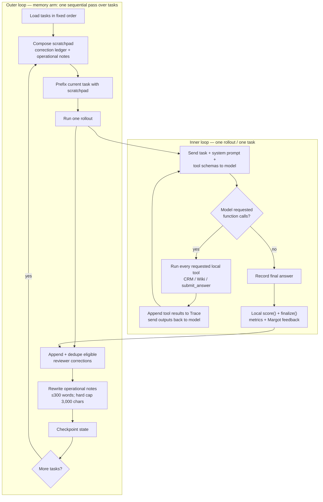

I’ll use a compact flow diagram here because the two nested loops are much clearer visually than in prose.

The **outer loop** learns across episodes. The **inner loop** lets the model use tools within one episode.

The inner loop repeats until the model stops requesting tools, or the driver reaches its safety limit. Each cycle is:

1. The model receives the current task, its previous tool outputs, and available tool schemas.
2. It either asks for CRM/wiki tools or stops.
3. The driver executes requested tools locally and returns their JSON results to the model.
4. The model decides whether another tool call is needed.
5. The model calls `submit_answer`, or emits final text; the evaluator scores it and produces feedback.

This is implemented in [`run_rollout()`](/Users/rezamalek/Documents/develop/touch-weights-hack/hackathon/examples/responses_rollouts.py:129). The driver permits up to 12 configured tool-turn batches, but a batch may contain more than one tool call.

The outer loop runs only in the memory condition:

1. Build the scratchpad from all remembered corrections plus the current operational-note summary.
2. Run the inner loop for the next task.
3. Add new reviewer corrections to the permanent ledger.
4. Replace the operational notes with a concise summary of what was observed.
5. Save a checkpoint and move to the next task.

That sequence is in [`run_memory_arm()`](/Users/rezamalek/Documents/develop/touch-weights-hack/hackathon/examples/scratchpad_loop.py:123).

For comparison, the script also runs a separate **stateless arm**: it invokes the same inner rollout for each task but with no scratchpad and may run tasks concurrently. Its purpose is only to show whether the outer-loop memory creates real improvement.